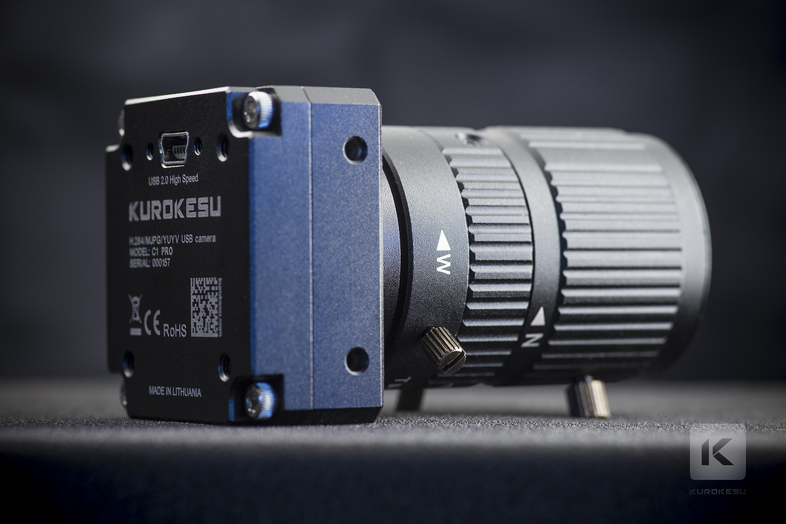

Sonix chipset based [Kurokesu C1 family USB camera](https://www.kurokesu.com/shop/cameras) extension unit parameter control toolset (like h.264 compression rate, measurement mode, GPIO, ...)




# Compile


```
cd C1_SONIX_Test_AP
cp Makefile.x86 Makefile
make
```

# Using TestAP

## Print help
```
./SONiX_UVC_TestAP -h
```

```
v1.0.22_SONiX_UVC_TestAP_Multi
kernel version 40f00
optind:2  optopt:0
Usage: ./SONiX_UVC_TestAP [options] device
Supported options:
-c, --capture[=nframes] Capture frames
-d, --delay             Delay (in ms) before requeuing buffers
-e,                     enum MaxPayloadTransferSize
-f, --format format     Set the video format (mjpg or yuyv)
-h, --help              Show this help screen
-i, --input input       Select the video input
-l, --list-controls     List available controls
-n, --nbufs n           Set the number of video buffers
-s, --size WxH          Set the frame size
    --fr framerate      Set framerate
-S, --save              Save captured images to disk
    --enum-inputs       Enumerate inputs
    --skip n            Skip the first n frames
-r, --record            Record H264 file
--still                         get still image
--still2 fmt w h        get still image
--bri-set values        Set brightness values
--bri-get               Get brightness values
--shrp-set values       Set sharpness values
--shrp-get              Get sharpness values
--dbg value             Set level of debug message(bit0:usage, bit1:error, bit2:flow, bit3:frame)
--vnd-get               Get vender version
SONiX XU supported options:
-a,  --add-xuctrl                       Add Extension Unit Ctrl into Driver
     --xuget id cs datasize d0 d1 ...   XU Get command: xu_id control_selector data_size data_0 data_1 ...
     --xuset id cs datasize d0 d1 ...   XU Set command: xu_id control_selector data_size data_0 data_1 ...
     --xuget-chip              Read SONiX Chip ID
     --xuget-qp                Get H.264 QP values
     --xuset-qp val            Set H.264 QP values: val
     --xuget-br                Get H.264 bit rate (bps)
     --xuset-br val            Set H.264 bit rate (bps)
     --asic-r addr             [Hex] Read register address data
     --asic-w addr data        [Hex] Write register address data
     --sf-r addr len           [Hex] Read sf address data
     --i2c-r ID addr data_len             [Hex] i2c read(fill Zero in LSB)
     --i2c-w ID addr data data_len        [Hex] i2c write(fill Zero in LSB)
     --mf val                   Set Multi-Stream format:[1]HD+QVGA [2]HD+180p [4]HD+360p [8]HD+VGA [10]HD+QVGA+VGA [20]HD+QVGA [40]HD+180p+360p [80]360p+180p
     --mgs                              Get Multi-Stream Status.
     --mgi                              Get Multi-Stream Info.
     --msqp StreamID QP                 Set Multi-Stream QP. StreamID = 0 ~ 2
     --mgqp StreamID                    Get Multi-Stream QP. StreamID = 0 ~ 2
     --msbr StreamID Bitrate            Set Multi-Stream Bitrate (bps). StreamID = 0 ~ 2
     --mgbr StreamID                    Get Multi-Stream BitRate (bps). StreamID = 0 ~ 2
     --mscvm StreamID H264Mode          Set Multi-Stream H264 Mode. StreamID = 0 ~ 2(1:CBR 2:VBR)
     --mgcvm StreamID                   Get Multi-Stream H264 Mode. StreamID = 0 ~ 2
     --msfr val                         Set Multi-Stream substream frame rate.
     --mgfr                             Get Multi-Stream substream frame rate.
     --msgop val                        Set Multi-Stream substream GOP(suggest GOP = fps-1).
     --mggop                            Get Multi-Stream substream GOP.
     --mse Enable                       Set Multi-Stream Enable : [0]Disable [1]H264  [3]H264+Mjpg.
     --mge                              Get Multi-Stream Enable.
     --xuset-timer Enable               Set OSD Timer Counting  1:enable   0:disable
     --xuset-rtc year month day hour min sec    Set OSD RTC
     --xuget-rtc                        Get OSD RTC
     --xuset-os Line Block              Set OSD Line and Block Size (0~4)
     --xuget-os                         Get OSD Line and Block Size (0~4)
     --xuset-oc Font Border             Set OSD Font and Border Color   0:Black  1:Red  2:Green  3:Blue  4:White
     --xuget-oc                         Get OSD Font and Border Color   0:Black  1:Red  2:Green  3:Blue  4:White
     --xuset-oe Line Block              Set OSD Show  1:enable  0:disable
     --xuget-oe                         Get OSD Show  1:enable  0:disable
     --xuset-oas Line Block             Set OSD Auto Scale  1:enable  0:disable
     --xuget-oas                        Get OSD Auto Scale  1:enable  0:disable
     --xuset-oms Stream0 Stream1 Stream2        Set OSD MultiStream Size  (0~4)
     --xuget-oms                        Get OSD MultiStream Size  (0~4)
     --xuset-osp Type Row Col           Set OSD Start Row and Col (unit:16)
     --xuget-osp                        Get OSD Start Row and Col (unit:16)
     --xuset-ostr Group '.....'         Set OSD 2nd String.Group from 0 to 2.8 words per 1 Group.
     --xuget-ostr Group                 Get OSD 2nd String.
     --xuset-omssp StreamID Row Col     Set OSD Multi stream start row and col.
     --xuget-omssp                      Get OSD Multi stream start raw and col.
     --xuset-mde Enable                 Set Motion detect enable
     --xuget-mde                        Get Motion detect enable
     --xuset-mdt Thd                    Set Motion detect threshold (0~65535)
     --xuget-mdt                        Get Motion detect threshold
     --xuset-mdm  m1 m2 ... m24         Set Motion detect mask
     --xuget-mdm                        Get Motion detect mask
     --xuset-mdr  m1 m2 ... m24         Set Motion detect result
     --xuget-mdr                        Get Motion detect result
     --xuset-mjb Bitrate                Set MJPG Bitrate (bps)
     --xuget-mjb                        Get MJPG Bitrate (bps)
     --xuset-if nframe                  Set H264 reset to IFrame.  nframe : reset per nframe.
     --xuset-sei                        Set H264 SEI Header Enable.
     --xuget-sei                        Get H264 SEI Header Enable.
     --xuset-gop                        Set H264 GOP. (1 ~ 4095)
     --xuget-gop                        Get H264 GOP.
     --xuset-cvm                        Set H264 CBR/VBR mode(1:CBR 2:VBR)
     --xuget-cvm                        Get H264 CBR/VBR mode(1:CBR 2:VBR)
     --xuset-mir                        Set Image mirror.
     --xuget-mir                        Get Image mirror.
     --xuset-flip                       Set Image flip.
     --xuget-flip                       Get Image flip.
     --xuset-gpio enable out_value      Set GPIO ctrl(hex).
     --xuget-gpio                       Get GPIO ctrl.
     --xuset-clr                        Set Image color.
     --xuget-clr                        Get Image color.
     --xuset-fde s1 s2                  Set Frame drop enable.
     --xuget-fde                        Get Frame drop enable.
     --xuset-fdc s1 s2                  Set Frame drop value.
     --xuget-fdc                        Get Frame drop value.
```


## Save MJPG frames (/dev/video0 is MJPG interface)
```
./SONiX_UVC_TestAP /dev/video0 -c -f mjpg -S
```

## Save H.264 video data (/dev/video1 is H.264 interface, need SONiX UVC Like Driver support)
```
./SONiX_UVC_TestAP /dev/video1 -c -f H264 -r
```

## Extension Unit (XU) controls

### Add XU ctrls to uvc driver (if uvc driver doesn't support)
```
./SONiX_UVC_TestAP /dev/video1 -a
```

### Get & Set H.264 resolutions & framerates (1280x720, 24fps), Insure getting format before setting format !
```
./SONiX_UVC_TestAP /dev/video1 --xuget-fmt --xuset-fmt 1-1
```

### Get & Set H.264 QP/Bitrates(Kbps)
```
./SONiX_UVC_TestAP /dev/video1 --xuget-qp --xuset-qp 31 --xuget-br --xuset-br 6882

```
### Get and set bitrate
```
./SONiX_UVC_TestAP --xuget-br /dev/video1
./SONiX_UVC_TestAP --xuset-br 1000 /dev/video1
./SONiX_UVC_TestAP --xuset-br 1000000 /dev/video1
./SONiX_UVC_TestAP --xuset-br 10000000 /dev/video1
./SONiX_UVC_TestAP --xuset-gop 100 /dev/video1
```

### Set framerate
```
./SONiX_UVC_TestAP --fr 30 /dev/video1
./SONiX_UVC_TestAP --msfr 30 /dev/video1
```

### Other settings
```
./SONiX_UVC_TestAP --xuset-gop 5 /dev/video1
./SONiX_UVC_TestAP --xuset-cvm 1 /dev/video1

./SONiX_UVC_TestAP --xuset-mir 1 /dev/video1
./SONiX_UVC_TestAP --xuset-flip 1 /dev/video1
./SONiX_UVC_TestAP --bri-get /dev/video1
./SONiX_UVC_TestAP --xuget-clr /dev/video1

./SONiX_UVC_TestAP --xuset-sei /dev/video1
./SONiX_UVC_TestAP --xuset-if 5 /dev/video1
    
     
./SONiX_UVC_TestAP --xuget-qp /dev/video1
./SONiX_UVC_TestAP --xuget-gop /dev/video1

./SONiX_UVC_TestAP --xuget-gop /dev/video1
```
